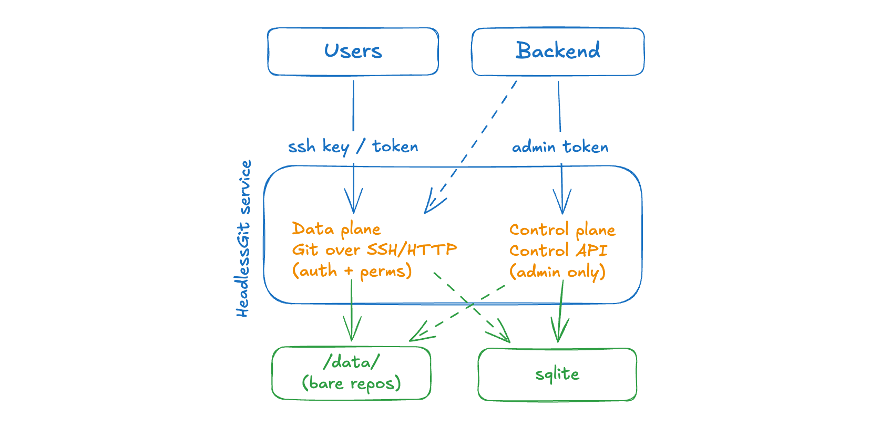

# HeadlessGit

This is a simple **headless Git server**, Git hosting _primitives_ (SSH/HTTP transport, authentication, permissions, storage) for projects that might need a Git-ish backend, but it doesnt need a full forge UI.

Basically, this is just a Git layer of infrastructure you'd put _underneath_ a proejct. This service is not responsible for billing and the UI, etc etc. It just handles the actual `git` transport, enforces access, and stores the bare repositories.

## What it is

- Basic Git over **SSH** and **HTTP** for clone / fetch / push.
- A small **control API**, RESTful api to manage repositories, users, SSH keys, tokens, and permissions.
- Simple **permission model** (`read` / `write` / `admin`) enforced before every Git operation.
- Bare-repository storage on a filesystem, with SQLite for metadata.

## Example

Start the server using `headlessgit` image (it already bundles `git`):

```sh
docker run --rm \
  -p 4000:4000 -p 4001:4001 -p 2222:2222 \
  -v "$PWD/data:/data" \
  -e DATABASE_URL=/data/headlessgit.db \
  -e ADMIN_TOKEN="$(openssl rand -hex 32)" \
  ghcr.io/axenos-dev/headlessgit:latest
```

That brings up three listeners - Git over HTTP (`4000`) and SSH (`2222`) for clients, and the control API (`4001`) for your backend. `ADMIN_TOKEN` seeds an admin service account on boot — your backend uses it as a bearer token to provision accounts, repositories, and permissions through the [control API](#control-api).

Once user has a repository and credentials, they can you it like any other Git remote — the path is always `<owner-username>/<repo-name>.git`:

```sh
# over SSH, authenticated by a registered public key
git clone ssh://localhost:2222/acme/api.git

# over HTTP, authenticated by a token
git clone http://x:<token>@localhost:4000/acme/api.git
```

For local development, see [`./dev.sh up`](#development).

## Integration model



- **Backend** using the admin token calls the control API to create accounts, register credentials, create repositories, and grant permissions - translating its own users into explicit repo grants here.
- **Users** use the data plane directly with their own credentials (SSH key or token). Service authenticates them and authorizes each operation against the permissions they have.

### Identities

An account is either a `user` (a human with a Git client) or a `service` (a machine — backend). They authenticate identically and are authorized by the same per-repo permissions. The seeded `ADMIN_TOKEN` account is an admin service account — typically application's backend, which going to use the

### Recommended deployment

- Keep the **control API on an internal interface** — it's the privileged plane. The data-plane ports are the ones you expose to clients.
- Treat `ADMIN_TOKEN` as a secret. Rotate it by changing the env value and restarting the service (to reseed the admin account).
- Persist `/data` (bare repos, the SQLite file, and the SSH host key all live there).

## Configuration

All configuration is via environment variables.

| Variable            | Default                 | Description                                                                               |
| ------------------- | ----------------------- | ----------------------------------------------------------------------------------------- |
| `DATABASE_URL`      | _(required)_            | SQLite file path, e.g. `data/headlessgit.db`.                                             |
| `AUTO_MIGRATE`      | `true`                  | Run migrations on startup.                                                                |
| `ENVIRONMENT`       | `DEVELOPMENT`           | `DEVELOPMENT` or `PRODUCTION`.                                                            |
| `CONTROL_PORT`      | `4001`                  | Control API listener.                                                                     |
| `GIT_HTTP_PORT`     | `4000`                  | Git-over-HTTP listener.                                                                   |
| `GIT_SSH_PORT`      | `2222`                  | Git-over-SSH listener.                                                                    |
| `REPO_ROOT`         | `data/repos`            | Where bare repositories are stored.                                                       |
| `SSH_HOST_KEY_PATH` | `data/ssh/host_ed25519` | SSH host key file (generated on first boot if absent).                                    |
| `ADMIN_TOKEN`       | _(empty)_               | Raw token for the seeded admin account. Only its hash is stored. Empty = no admin seeded. |

See [`.env.example`](.env.example).

## Control API

Every request requires `Authorization: Bearer <ADMIN_TOKEN>`. Responses are enveloped: `{"data": ...}` on success, `{"error": {"code", "message"}}` on failure.

| Method   | Path                             | Body                          | Description                                                      |
| -------- | -------------------------------- | ----------------------------- | ---------------------------------------------------------------- |
| `POST`   | `/users`                         | `{username, kind}`            | Create a user/service account (`kind`: `user` \| `service`).     |
| `POST`   | `/users/{id}/ssh-keys`           | `{title, publicKey}`          | Register an SSH public key.                                      |
| `POST`   | `/users/{id}/tokens`             | `{title}`                     | Mint a token; the raw value is returned **once**.                |
| `POST`   | `/repositories`                  | `{ownerId, name, visibility}` | Create a repository (`visibility`: `public` \| `private`).       |
| `GET`    | `/repositories/{id}`             | —                             | Get repository metadata.                                         |
| `DELETE` | `/repositories/{id}`             | —                             | Delete a repository (row + bare repo).                           |
| `PUT`    | `/repositories/{id}/permissions` | `{userId, role}`              | Grant/update a collaborator role (`read` \| `write` \| `admin`). |

## Development

```sh
./dev.sh up     # build and run the stack (docker compose)
./dev.sh gen    # regenerate sqlc code
./dev.sh test   # build + vet + test (what CI runs)
```

## License

[MIT](LICENSE)
