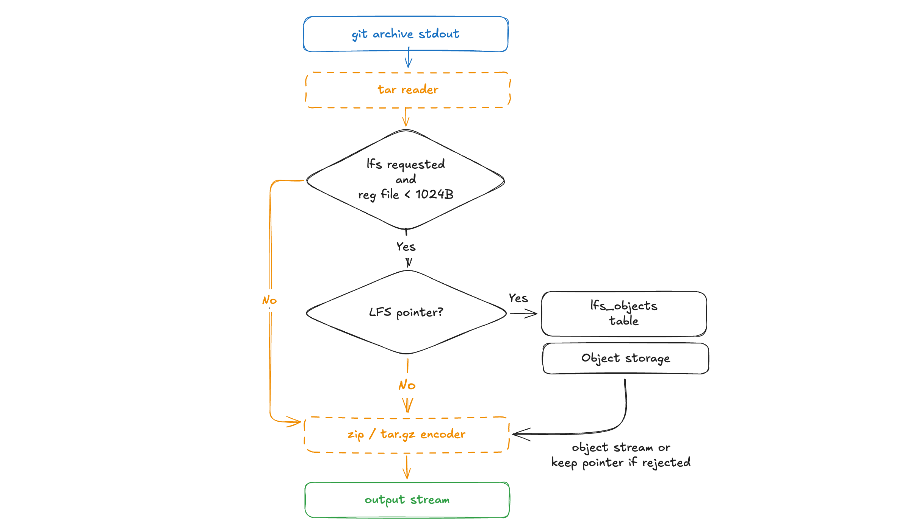
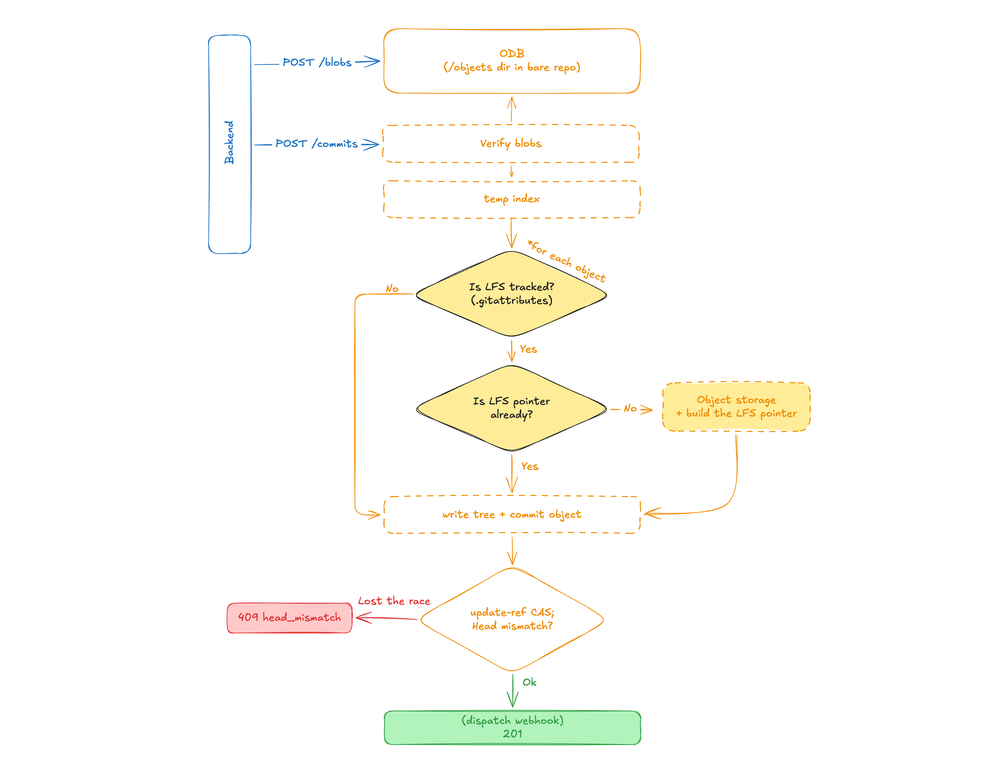

# HeadlessGit

A headless Git server for platforms and internal tools.

Provides Git hosting _primitives_ (git over SSH/HTTP, authentication, permissions, storage) and pluggable storage.

Basically, this is a Git layer of infrastructure you'd put _underneath_ a project. This service is not responsible for billing and the UI, etc. It just handles the actual `git` transport, enforces access, and stores the bare repositories.

## What it is

- Basic Git over **SSH** and **HTTP** for clone / fetch / push.
- **Git LFS** for large files, with object storage on local disk or any S3-compatible bucket (AWS S3, Cloudflare R2, MinIO).
- A small **control API**, RESTful api to manage repositories, users, SSH keys, tokens, and permissions.
- A **repo content API** — list trees, read files, download zip/tar.gz archives, and create commits over REST, so your backend never needs a local clone.
- Simple **permission model** (`read` / `write` / `admin`) enforced before every Git operation.
- **Path policies** — block chosen paths from ever being committed, enforced identically on API commits and `git push` (via a pre-receive hook).
- **Push webhooks** — signed deliveries on every ref change, pushed or committed via the API.
- Bare-repository storage on a filesystem, with SQLite for metadata.

## Example

Start the server using `headlessgit` image (it already bundles `git`):

```sh
docker run --rm \
  -p 4000:4000 -p 4001:4001 -p 2222:2222 \
  -v "$PWD/data:/data" \
  -e DATABASE_URL=/data/headlessgit.db \
  -e ADMIN_TOKEN="$(openssl rand -hex 32)" \
  ghcr.io/axenos-dev/headlessgit:latest
```

That brings up three listeners - Git over HTTP (`4000`) and SSH (`2222`) for clients, and the control API (`4001`) for your backend. `ADMIN_TOKEN` seeds an admin service account on boot — your backend uses it as a bearer token to provision accounts, repositories, and permissions through the [control API](#control-api).

Once a user has a repository and credentials, they can use it like any other Git remote — the path is always `<owner-username>/<repo-name>.git`:

```sh
# over SSH, authenticated by a registered public key
git clone ssh://localhost:2222/username/api.git

# over HTTP, authenticated by a token
git clone http://x:<token>@localhost:4000/username/api.git
```

For local development, see [`./dev.sh up`](#development).

## Integration model


- **Backend** using the admin token calls the control API to create accounts, register credentials, create repositories, and grant permissions - translating its own users into explicit repo grants here.
- **Users** use the data plane directly with their own credentials (SSH key or token). Service authenticates them and authorizes each operation against the permissions they have.

### Identities

An account is either a `user` (a human with a Git client) or a `service` (a machine — backend). They authenticate identically and are authorized by the same per-repo permissions. The seeded `ADMIN_TOKEN` account is an admin service account — typically your application's backend, which uses it to provision accounts, repositories, and permissions.

### Recommended deployment

- Keep the **control API on an internal interface** — it's the privileged plane. The data-plane ports are the ones you expose to clients.
- Treat `ADMIN_TOKEN` as a secret. Rotate it by changing the env value and restarting the service (to reseed the admin account).
- Persist `/data` (bare repos, the SQLite file, and the SSH host key all live there).

### Repository storage

Today, bare repositories are stored on the local filesystem under `REPO_ROOT`. Support for keeping repositories on dedicated storage nodes over RPC is planned.

## Configuration

All configuration is via environment variables.

| Variable            | Default                 | Description                                                                               |
| ------------------- | ----------------------- | ----------------------------------------------------------------------------------------- |
| `DATABASE_URL`      | _(required)_            | SQLite file path, e.g. `data/headlessgit.db`.                                             |
| `AUTO_MIGRATE`      | `true`                  | Run migrations on startup.                                                                |
| `ENVIRONMENT`       | `DEVELOPMENT`           | `DEVELOPMENT` or `PRODUCTION`.                                                            |
| `CONTROL_PORT`      | `4001`                  | Control API listener.                                                                     |
| `GIT_HTTP_PORT`     | `4000`                  | Git-over-HTTP listener.                                                                   |
| `GIT_SSH_PORT`      | `2222`                  | Git-over-SSH listener.                                                                    |
| `REPO_ROOT`         | `data/repos`            | Where bare repositories are stored.                                                       |
| `SSH_HOST_KEY_PATH` | `data/ssh/host_ed25519` | SSH host key file (generated on first boot if absent).                                    |
| `ADMIN_TOKEN`       | _(empty)_               | Raw token for the seeded admin account. Only its hash is stored. Empty = no admin seeded. |
| `TOKEN_GC_INTERVAL` | `1h`                    | How often expired tokens are deleted. `0` disables the loop.                              |
| `REPO_GC_INTERVAL`  | `5h`                    | How often `git gc` sweeps the repositories (repack + prune). `0` disables the loop.       |
| `WEBHOOK_WORKERS`   | `3`                     | Goroutines delivering webhook events.                                                     |

See [`.env.example`](.env.example).

## Git LFS

Git LFS is enabled if `LFS_ENABLED=true` set in environment. Clients then use it transparently over both HTTP and SSH, and nothing beyond the usual `git lfs track`.

**Storage** sits behind an interface, separate from the bare repos. It can be one of those:

- `disk` (default) — objects stored locally on disk under `LFS_ROOT`.
- `s3` — any S3-compatible bucket (AWS S3, Cloudflare R2, MinIO). Transfers use **presigned URLs**, so object bytes flow directly between the client and the bucket instead of streaming through the server.

| Variable                   | Default                 | Description                                                                           |
| -------------------------- | ----------------------- | ------------------------------------------------------------------------------------- |
| `LFS_ENABLED`              | `false`                 | Enable Git LFS.                                                                       |
| `LFS_STORAGE_TYPE`         | `disk`                  | `disk` or `s3`.                                                                       |
| `LFS_PUBLIC_URL`           | _(required if enabled)_ | Externally-reachable base URL of the Git HTTP server, e.g. `https://git.example.com`. |
| `LFS_ROOT`                 | `data/lfs`              | Object directory when `LFS_STORAGE_TYPE=disk`.                                        |
| `LFS_S3_BUCKET`            | _(required for s3)_     | Bucket name.                                                                          |
| `LFS_S3_ENDPOINT`          | _(required for s3)_     | Host without scheme, e.g. `<account>.r2.cloudflarestorage.com`.                       |
| `LFS_S3_ACCESS_KEY_ID`     | _(required for s3)_     | Access key ID.                                                                        |
| `LFS_S3_SECRET_ACCESS_KEY` | _(required for s3)_     | Secret access key.                                                                    |
| `LFS_S3_REGION`            | _(empty)_               | Region; use `auto` for Cloudflare R2.                                                 |
| `LFS_S3_USE_SSL`           | `true`                  | Reach the endpoint over HTTPS.                                                        |
| `LFS_S3_USE_PATH_STYLE`    | `false`                 | Force path-style addressing (needed by some S3-compatible providers).                 |
| `LFS_S3_KEY_PREFIX`        | _(empty)_               | Optional prefix prepended to every object key.                                        |

## Control API

Every request requires `Authorization: Bearer <ADMIN_TOKEN>`. Responses are enveloped: `{"data": ...}` on success, `{"error": {"code", "message"}}` on failure.

**Accounts & credentials**

| Method   | Path                           | Body                 | Description                                                  |
| -------- | ------------------------------ | -------------------- | ------------------------------------------------------------ |
| `POST`   | `/users`                       | `{username, kind}`   | Create a user/service account (`kind`: `user` \| `service`); `409 user_exists` if the username is taken. |
| `GET`    | `/users/{id}`                  | —                    | Get an account.                                              |
| `GET`    | `/users/by-username/{username}` | —                   | Look up an account by username (name -> id resolution).      |
| `GET`    | `/users/{id}/repositories`     | —                    | List repositories owned by the account.                      |
| `POST`   | `/users/{id}/ssh-keys`         | `{title, publicKey}` | Register an SSH public key.                                  |
| `GET`    | `/users/{id}/ssh-keys`         | —                    | List the account's SSH keys.                                 |
| `DELETE` | `/users/{id}/ssh-keys/{keyId}` | —                    | Revoke an SSH key.                                           |
| `POST`   | `/users/{id}/tokens`           | `{title}`            | Mint a token; the raw value is returned **once**.            |
| `GET`    | `/users/{id}/tokens`           | —                    | List the account's tokens (never the secret).                |
| `DELETE` | `/users/{id}/tokens/{tokenId}` | —                    | Revoke a single token.                                       |
| `DELETE` | `/users/{id}/tokens`           | —                    | Revoke **all** of the account's tokens.                      |

**Repositories & permissions**

| Method   | Path                                          | Body                          | Description                                                       |
| -------- | --------------------------------------------- | ----------------------------- | ----------------------------------------------------------------- |
| `POST`   | `/repositories`                               | `{ownerId, name, visibility}` | Create a repository (`visibility`: `public` \| `private`); `409 repository_exists` if the owner already has one with that name. |
| `GET`    | `/repositories/{id}`                          | —                             | Get repository metadata.                                          |
| `GET`    | `/repositories/by-path/{namespace}/{name}`    | —                             | Look up a repository by owner username + name (name -> id resolution). |
| `PUT`    | `/repositories/{id}/visibility`               | `{visibility}`                | Change visibility (`public` \| `private`).                        |
| `DELETE` | `/repositories/{id}`                          | —                             | Delete a repository (row + bare repo).                            |
| `GET`    | `/repositories/{id}/permissions`              | —                             | List collaborators.                                               |
| `PUT`    | `/repositories/{id}/permissions`              | `{userId, role}`              | Grant/update a collaborator role (`read` \| `write` \| `admin`).  |
| `DELETE` | `/repositories/{id}/permissions/{userId}`     | —                             | Revoke a collaborator.                                            |
| `POST`   | `/repositories/{id}/webhooks`                 | `{url}`                       | Register a push webhook; the signing secret is returned **once**. `409 webhook_exists` if the URL is already registered on the repo. |
| `GET`    | `/repositories/{id}/webhooks`                 | —                             | List the repository's webhooks (never the secret).               |
| `DELETE` | `/repositories/{id}/webhooks/{hookId}`        | —                             | Delete a webhook.                                                 |
| `GET`    | `/repositories/{id}/path-policies`            | —                             | List the repository's path policies.                              |
| `POST`   | `/repositories/{id}/path-policies`            | `{pattern, reason?}`          | Block a path; see [Path policies](#path-policies).                |
| `DELETE` | `/repositories/{id}/path-policies/{policyId}` | —                             | Remove a policy.                                                  |

**Repository contents & commits**

| Method | Path                                           | Body        | Description                                                            |
| ------ | ---------------------------------------------- | ----------- | ---------------------------------------------------------------------- |
| `GET`  | `/repositories/{id}/contents?ref=&path=`       | —           | List one directory level of the tree at a ref.                         |
| `GET`  | `/repositories/{id}/blob?ref=&path=&lfs=`      | —           | Stream one file's raw content.                                         |
| `GET`  | `/repositories/{id}/archive?ref=&format=&lfs=&prefix=` | —           | Stream a `zip` (default) or `tar.gz` archive of the tree.              |
| `POST` | `/repositories/{id}/blobs`                     | _raw bytes_ | Upload content into the repo's object database; returns `{sha, size}`. |
| `POST` | `/repositories/{id}/commits`                   | JSON        | Create a commit on a branch from uploaded blobs.                       |

### Reading a repository

`ref` accepts anything git can resolve to a commit — a branch, tag, sha, or expression like `main~2` — and defaults to `HEAD`. Every response is pinned to the exact commit it was answered from, so consumers can page through a repository without seeing a torn view mid-push.

`GET /contents` returns the entries of one directory level:

```json
{
  "data": {
    "ref": "main",
    "sha": "9fb037999f264ba9a7fc6274d15fa3ae2ab98312",
    "path": "src",
    "entries": [
      {
        "name": "main.go",
        "path": "src/main.go",
        "type": "file",
        "mode": "100644",
        "size": 1234,
        "sha": "..."
      },
      {
        "name": "vendor",
        "path": "src/vendor",
        "type": "dir",
        "mode": "040000",
        "sha": "..."
      }
    ]
  }
}
```

`type` is `file` | `dir` | `symlink` | `submodule`. Listings over 10k entries set `"truncated": true`.

`GET /blob` streams the file bytes with `Content-Length`, a strong `ETag` (the blob sha — content-addressed, so `If-None-Match` caching works perfectly), and `X-HeadlessGit-Commit` carrying the resolved commit. With `lfs=true`, an LFS pointer file is replaced by the real object; a missing object is a `404` rather than silently serving the pointer.

`GET /archive` streams the whole tree as an artifact, named `<repo>-<shortsha>.zip`. By default its entries are under the matching `<repo>-<shortsha>/` directory. Set `prefix=release/source` to choose another directory, or explicitly set `prefix=` to place entries at the archive root. Prefixes are relative directory paths and a trailing `/` is optional.

With `lfs=true`, pointer files are swapped for the real objects **in-flight** — the archive is re-encoded entry by entry, nothing is buffered or written to disk:



A pointer whose object is missing stays a pointer.

### Writing without a clone

Commits follow two-step model: upload content first, then commit metadata referencing it.



```sh
# 1. upload each new/changed file's bytes (raw body, streamed)
curl -H "Authorization: Bearer $TOKEN" \
  --data-binary @config.yaml \
  http://localhost:4001/repositories/7/blobs
# -> {"data": {"sha": "44b4fc6d...", "size": 812}}

# 2. create the commit (atomic, any number of operations)
curl -H "Authorization: Bearer $TOKEN" -X POST \
  http://localhost:4001/repositories/7/commits -d '{
    "branch": "main",
    "message": "update config",
    "author": { "name": "deploy-bot", "email": "bot@example.com" },
    "expectedHeadSha": "9fb03799...",
    "operations": [
      { "op": "put", "path": "config.yaml", "blobSha": "44b4fc6d..." },
      { "op": "delete", "path": "config.old.yaml" }
    ]
  }'
# -> 201 {"data": {"branch": "main", "commitSha": "...", "before": "9fb03799..."}}
```

`expectedHeadSha` controls concurrency:

| Value            | Meaning                                                                                  |
| ---------------- | ---------------------------------------------------------------------------------------- |
| _(omitted)_      | Last write wins.                                                                         |
| a commit sha     | Compare-and-swap: `409 head_mismatch` if the branch moved.                               |
| the all-zero sha | The branch must not exist yet — creates it (or the first commit on an empty repository). |

Content is deduplicated by sha, so retrying an upload is free and a lost `409` race can be retried without re-uploading anything. Blobs that never get committed are garbage-collected after a grace period (see `REPO_GC_INTERVAL`).

**LFS is automatic**, the same way it is for a git client: if the repo's `.gitattributes` marks a path as `filter=lfs` (including attributes added in the very same commit), the server stores the content as an LFS object and commits a pointer instead. Content that already _is_ a valid pointer passes through untouched, so pre-uploading big files via the LFS API (presigned, straight to the bucket) and committing the pointer yourself remains the efficient path for large objects.

API commits dispatch the same signed [webhooks](#webhooks) as a `git push` — consumers can't tell them apart.

### Health

The control port also serves an unauthenticated `GET /healthz` readiness probe. It returns `200 {"status":"ok"}` when the database is reachable and `503 {"status":"unavailable"}` otherwise, and backs the container `HEALTHCHECK`.

## Path policies

A path policy blocks a path, and everything under it from being **added or modified** in a repository.

```sh
curl -H "Authorization: Bearer $TOKEN" -X POST \
  http://localhost:4001/repositories/7/path-policies \
  -d '{"pattern": "runtime/", "reason": "....."}'
```

Semantics:

- A pattern matches the exact path and its whole subtree: `runtime` blocks `runtime` and `runtime/state.json`, but not `runtime.md` or `src/runtime/x` — patterns anchor at the repo root and match whole path segments.
- **Deletes are always allowed**, so blocked content already in history can be cleaned up.
- Policies apply to **new commits only**.
- Enforcement is identical on both write paths: `POST /commits` returns `422 path_blocked`, and a `git push` is rejected by a pre-receive hook **before any ref moves** — every commit in the push is checked, so a blocked path added and removed within the same push is still refused. The client sees the `reason` verbatim:

```txt
remote: push rejected: "runtime/state.json" is blocked by policy (.....)
 ! [remote rejected] main -> main (pre-receive hook declined)
```

## Webhooks

Register a webhook on a repository and `headlessgit` will `POST` to it after every ref change — a `git push` or a commit created through the [content API](#writing-without-a-clone) produce identical events. A repository can have multiple webhooks, but each URL only once (`409 webhook_exists` on duplicates); to rotate a secret, delete the webhook and re-register it.

One delivery is sent **per changed ref** (a branch/tag create, update, or delete — not per file or commit). The JSON body:

```json
{
  "event": "push",
  "ref": "refs/heads/main",
  "before": "0000000000000000000000000000000000000000",
  "after": "344018f5c8bce597cfb1b13058edc688f3a13230",
  "created": true,
  "deleted": false,
  "repository": {
    "id": 6,
    "name": "HeadlessGit",
    "full_name": "Axenos-dev/HeadlessGit"
  },
  "pusher": { "id": 7, "username": "Axenos-dev" },
  "timestamp": "2026-06-29T19:06:48Z"
}
```

`before`/`after` are the ref's SHAs around the push; a create has `before` all-zero (`created: true`), a delete has `after` all-zero (`deleted: true`). `repository.full_name` is `namespace/name`.

Each request carries these headers:

| Header                    | Value                                                                         |
| ------------------------- | ----------------------------------------------------------------------------- |
| `X-HeadlessGit-Event`     | `push`                                                                        |
| `X-HeadlessGit-Delivery`  | Unique id for this delivery attempt.                                          |
| `X-HeadlessGit-Signature` | `sha256=<hex>` — HMAC-SHA256 of the **raw body** keyed by the webhook secret. |

Verify a delivery by recomputing the HMAC over the exact request body with the secret returned at registration, e.g.:

```go
mac := hmac.New(sha256.New, []byte(secret))
mac.Write(body)
expected := "sha256=" + hex.EncodeToString(mac.Sum(nil))
ok := hmac.Equal([]byte(expected), []byte(r.Header.Get("X-HeadlessGit-Signature")))
```

The secret is generated server-side and shown **once** in the registration response.

## Development

```sh
./dev.sh up     # build and run the stack (docker compose)
./dev.sh gen    # regenerate sqlc code
./dev.sh test   # build + vet + test (what CI runs)
```

## License

[MIT](LICENSE)
